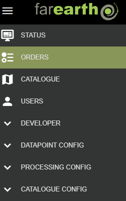
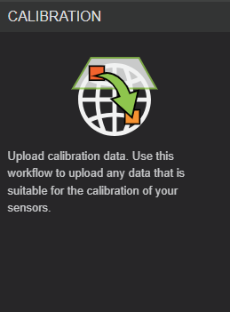
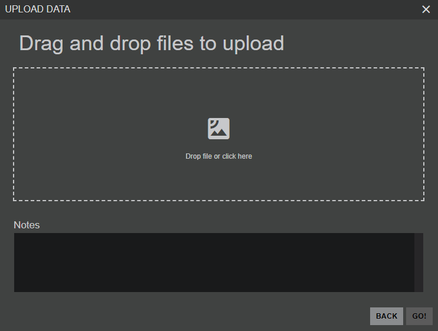

# Upload your calibration data

## Step 1: log into *FarEarth*
* Navigate to *FarEarth*: https://gateway.farearth.space/
* Log in with your e-mail and password

**NOTE**: *If you do not have access to FarEarth yet, reach out to your FarEarth system administrator for access.*

## Step 2: create an order
* Navigate to the hamburger menu (3 stripes) top left

* Click on "ORDERS"
* Click on the "CREATE ORDER" button

## Step 3: choose a workflow

* Click on the "CALIBRATION" wizard

## Step 4: upload data

* Drag and drop your calibration data into the "Drop file or click here" box
* Enter a note about the content of your files you  uploaded
* Please wait for the files to upload
* Click on the "GO" button
* *FarEarth* will now create a new *Order* 
* Your data will be uploaded to your *FarEarth* *Archive* 
* To view the progress of your upload, navigate to the "ORDERS" page 

