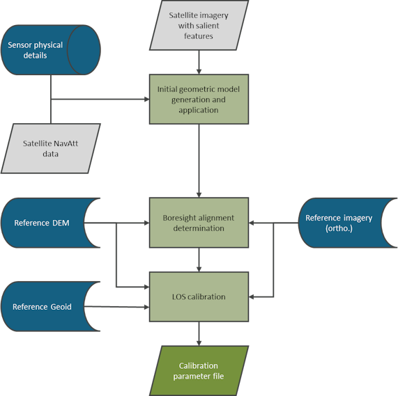
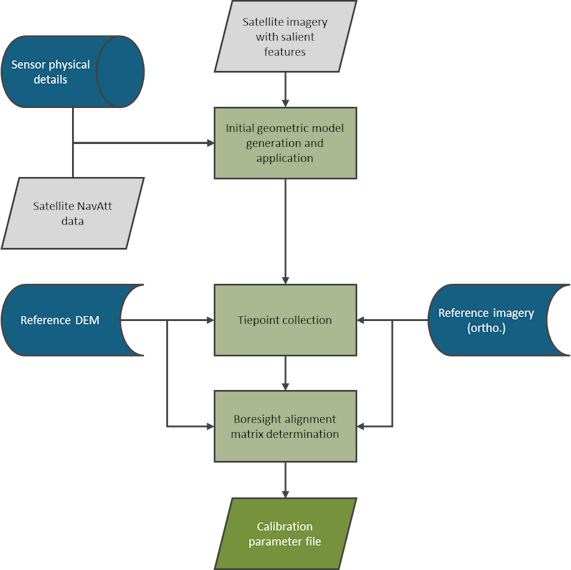

# Level 1 theory book: Geometric algorithms

##### [Home](../../../README.md) > [Level 1](../../../Level%201/) > [Theory books](../../Theory%20books/) > [Version 1.2](../Version%201.2/) > Theory book: Geometric algorithms
---

### Table of contents
- [Introduction](#introduction)
- [Geometry](#geometry)
   * [Geometric calibration](#geometric-calibration)
      + [Boresight alignment calibration](#boresight-alignment-calibration)
      + [Line-of-sight calibration](#line-of-sight-calibration)
   * [Geometric processing - product generation](#geometric-processing---product-generation)
      + [Systematic alignment](#systematic-alignment)
      + [Precision alignment](#precision-alignment)
      + [Processing summary](#processing-summary)
   * [Geometric validation](#geometric-validation)
   * [Uncertainty characterisation](#uncertainty-characterisation)

## Introduction

This document describes the geometric algorithms used to calibrate, process, and validate imagery of an Earth observation sensor using *FarEarth*. This document applies to both reflective and emissive products. It is intended as a summary of the algorithms used. 

The following terminology is specific to *FarEarth*: 

| Term | Description |
| ---- | ----------- |
| Calibration Parameter File (CPF) | File containing information on the physical sensor properties, band descriptions, and the geometric calibration coefficients       |
| Tiepoints | Salient features on both the satellite image and the reference image, which match the satellite image coordinates to the reference image coordinates |
| Systematic or precision model | Orthorectification and band alignment can be performed using either a systematic or a precision model. A systematic model is constructed using only the geometric calibration coefficients and the satellite's Navigation and Attitude (NavAtt) data. A precision model is a refined model that incorporates tiepoints. For orthorectification, tiepoints to an absolute geometric reference image are used. For band alignment, relative tiepoints between bands are used    |

## Geometry

Geometric algorithms are used to:
* determine the boresight alignment rotation matrices required to align the sensor with the satellite's pose (attitude)
* determine the line-of-sight polynomial coefficients needed to project each detector/pixel to the Earth
* process the sensor's raw data to band-aligned, orthorectified, and map-projected images
* validate the quality of the geometric products by comparison to references

###	Geometric calibration
In-orbit geometric calibration consists of two main parts:
* boresight alignment calibration
* line-of-sight calibration

Reference orthorectified imagery is used in both boresight alignment and line-of-sight calibration.

> Geometric calibration overview

#### Boresight alignment calibration

Boresight alignment is the process of aligning the imaging sensor's frame with the satellite's attitude frame. In most cases, the primary imaging sensor on a telescope is mechanically aligned to have the same pointing orientation as the satellite attitude determination and control system (ADCS). The satellite's attitude frame is often closely aligned with the imaging sensor frame. There might be a misalignment bias between these two frames. This bias can be intentional by design, or due to sensor and/or ADCS alignment inaccuracies during the manufacturing or assembly process. Other causes include launch shock and outgassing, to name a few.  

Boresight alignment calibration involves determining a 3D Euler rotation matrix that will be applied to align the imaging sensor and satellite attitude frames.
Initially, boresight alignment is performed by systematically projecting a scene onto the Earth using a geometric sensor model based on physical parameters. These parameters include:

* the along and across sensor instantaneous field of view (per detector)
* sensor along and across detector counts
* a perfect alignment between the telescope and the ADCS (identity Euler rotation matrix)

A single reference band is used for boresight calibration. After the image is initially systematically projected to the Earth, tiepoints around the centre of the image are collected against a reference orthorectified image (for example, Sentinel). The calibration image must be cloud-free and acquired at near-nadir (off-nadir < 5°). The reference orthorectified image needs to be an image of the same area, which is also cloud-free and temporally close to the satellite image.

 to a reference Sentinel-2 orthorectified image (grey)")

> In the images above, the left is the initial systematically projected image, 
in the centre are the tiepoints between the central band and reference image, right shows the before (red) and after (green) boresight-aligned central band.

From these tiepoints, a 3D Euler rotation matrix is determined. This matrix is stored in the calibration parameter file (CPF) for future use.

**NOTE**: *If a satellite has multiple sensors on board, each sensor will have its own boresight alignment matrix. It is also possible to specify one reference boresight alignment matrix and express the alignment of the other sensor(s) relative to this reference sensor.*

> Boresight alignment calibration

#### Line-of-sight calibration

Line-of-sight (LOS) calibration provides a model that describes a pointing vector for each detector within each band. The goal of line-of-sight calibration is to determine the best set of coefficients for the along- and across-scan components of the LOS vectors per band, that will align the bands with each other. The LOS vectors are 3D pointing vectors projected from the detectors to Earth. Each band has a model that generates the pointing vector for each detector. Generally, the along and across components of the LOS vector are expressed as polynomial functions.

To determine the polynomial coefficients, tiepoints are collected between satellite imagery incorporating the boresight alignment and reference orthorectified images (for example, Sentinel-2). The calibration image must be cloud-free and preferably acquired at near-nadir (off-nadir < 5°). The reference orthorectified image is an image of the same area, which is also cloud-free and temporally close to the satellite image.

Using these tiepoints, the LOS coefficients are determined to minimise the geolocation disparities when applying the geometric sensor model.

The final LOS models are determined per band and stored in the CPF for future use.

 calibration flowchart")

> Line-of-sight (LOS) calibration

### Geometric processing - product generation

During image processing, the satellite image is geometrically corrected to be accurately located on the Earth, and the images from individual sensor bands are aligned to each other. The geometric processing steps are:

* raw to Level 0 - no geometric processing applied
* Level 0 to Level 1A - systematic geolocation model is generated
* Level 1A to Level 1B - if possible, a precision orthorectification and band alignment model is generated. The band alignment model (systematic or precision) is applied
* Level 1B to Level 1C - orthorectification model (systematic or precision) is applied, and a geometric quality assessment is performed

> Geometric processing steps

#### Systematic alignment

The boresight alignment is performed by applying the rotation as defined by the boresight alignment matrix contained in the satellite's Calibration Parameter File (CPF).

For a given scanline, each detector is projected onto Earth. The algorithm casts a ray for each detector from the satellite onto Earth using the line-of-sight (LOS) coefficients contained in the CPF and the NatAtt data associated with the scanline.

*FarEarth* uses the WGS84 model (World Geodetic System 1984) Earth model. The WGS84 model is an Earth-Centred Earth-Fixed (ECEF) model; thus, the satellite's ephemeris data must be transformed into an ECEF reference frame to be compatible. The projection traces the intersection point of the LOS ray onto the Earth's ellipsoid. If a digital elevation model (DEM) is used, the ray is traced until the desired height above the ellipsoid is found. 

The satellite's attitude is transformed into a Local-Vertical Local-Horizontal (LVLH) reference frame, allowing for direct mapping of the orientation from the satellite.

#### Precision alignment

After systematic alignment, tiepoints are collected between the reference band on the sensor and an orthorectified reference image, as was done during the calibration process. This is used to refine the geometric model of the sensor's reference band. 

If this refinement process is successful, the product's orthorectification is flagged as "PRECISION". At the same time, if it cannot be performed due to a lack of cloud-free reference imagery or an inability to collect tiepoints (for example, due to homogeneous areas), the orthorectification is flagged as "SYSTEMATIC".

For precision band alignment, tiepoints are collected between the different bands of the sensor. The disparities between the bands are determined, and the most suitable alignment paths between the bands are used to align them to the sensor's reference band.

If this alignment refinement process is successful for all bands, the product's band alignment is flagged as "PRECISION"; otherwise, it is flagged as "SYSTEMATIC".

**NOTE**: *For satellites with multiple sensors, various methods can be used to perform geometric processing. For instance, the sensors can either be processed independently, with each sensor having its own boresight matrix applied and its own tiepoints collected to a reference image. Alternatively, they can be processed using only one sensor as a reference and then aligning the other sensor to this reference.*

#### Processing summary

> Level 1A to Level 1B processing

> Level 1B to Level 1C processing

### Geometric validation

Geometric validation is performed to determine the geometric quality of the generated products using [GVerify](https://github.com/pinkmatter/GVerify)

GVerify uses a similar process to geometric calibration and precision alignment processes discussed above. Tiepoints are collected between the product's reference band image and a reference orthorectified image. The reference image should cover the same spatial extent, temporally close to the acquisition date, and should be cloud-free. This is used to estimate the geometric accuracy compared to the reference image. Tiepoints are collected between the sensor's bands to measure the relative precision of band alignment.

GVerify metadata and an image of the tiepoints' disparities are overlayed on the image and generated with the product. Disparities are colour-coded to indicate the level of severity. The disparities are used to determine the Mean Error and Circular Error with a 95% probability (CE95), which is published in the L1C product report. 

 and CE95 scatter plot (right) provided with L1C products.")

> Examples of an absolute geometric validation GVerify image (left) and CE95 scatter plot (right) provided with L1C products

The scatter plot shows the distribution of the tiepoints x and y disparities (red points), the GSD of the satellite image (green circle), GSD of the reference image (blue circle), and CE95 (red circle - below the green circle).

If the results of the geometric quality assessment reveal any drift or abnormal behaviour, the geometric calibration can be updated using more recently acquired imagery.

**NOTE**: *Quality assessment is configurable. For instance, if multiple sensors (for example, a VNIR and TIR sensor) are employed that capture images over the same area, it is possible to perform the geometric validation separately per sensor using a reference band per sensor (for example, red for VNIR, and 11 µm for TIR), or to use a single reference band from one sensor and check the band alignment between this band and all other bands from both sensors.*

### Uncertainty characterisation

Although a complete uncertainty evaluation is not performed for every product, the GVerify process provides an indication of geometric accuracy and precision by comparing the product to a reference orthorectified image.

The following factors contribute to the geometric uncertainty:

* uncertainty in the reference orthorectified images
* inaccuracies in the NavAtt data, especially attitude data, that can result in poor pointing accuracy
* issues with the boresight alignment due to inaccurate tiepoints between the sensor image and the reference orthorectified image
* issues with determining the LOS polynomials. The quality of the LOS polynomials is influenced by
  *	insufficient number of tiepoints 
  *   insufficient accuracy of tiepoints
  *	uneven distribution of tiepoints across the image
* uncertainty due to timing inaccuracies between the sensor and satellite NavAtt data
* uncertainty due to the misalignment and timing offsets between sensors using a multi-sensor design
