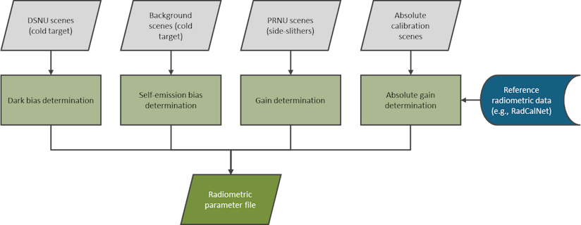
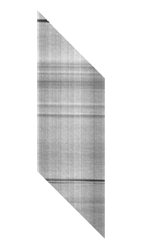
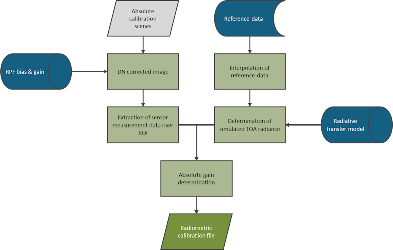
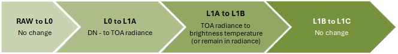
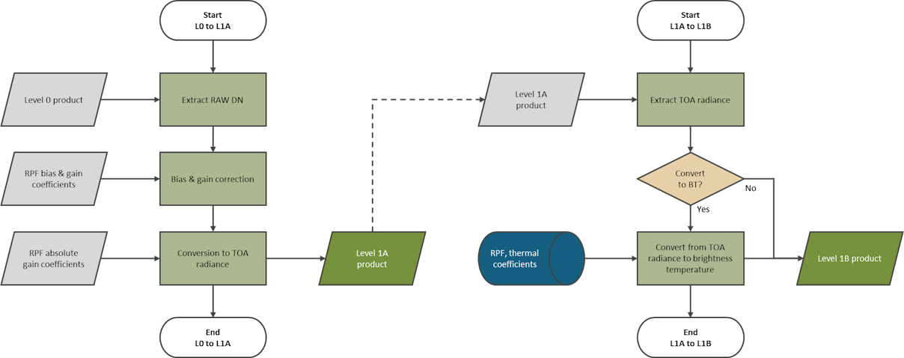

# Level 1 theory book: Radiometric emissive algorithms

##### [Home](../../../README.md) > [Level 1](../../../Level%201/) > [Theory books](../../Theory%20books/) > [Version 1.2](../Version%201.2/) > Theory book: Radiometric algorithms (emissive)
---

### Table of contents

- [Introduction](#introduction)
- [Radiometry](#radiometry)
   * [Radiometric calibration](#radiometric-calibration)
      + [Dark signal non-uniformity (DSNU) calibration](#dark-signal-non-uniformity-dsnu-calibration)
      + [Self-emission calibration](#self-emission-calibration)
      + [Photo response non-uniformity (PRNU) calibration](#photo-response-non-uniformity-prnu-calibration)
      + [Absolute radiometric calibration](#absolute-radiometric-calibration)
   * [Radiometric processing - product generation](#radiometric-processing---product-generation)
      + [DSNU correction](#dsnu-correction)
      + [Self-emission correction](#self-emission-correction)
      + [PRNU correction](#prnu-correction)
      + [Absolute radiometric conversion](#absolute-radiometric-conversion)
      + [Processing summary](#processing-summary)
   * [Radiometric validation](#radiometric-validation)
   * [Metrological traceability ](#metrological-traceability)
   * [Uncertainty characterisation](#uncertainty-characterisation)

## Introduction
This document describes the radiometric algorithms used to calibrate, process, and validate imagery of an Earth observation sensor using *FarEarth*. This document applies to emissive (thermal) imagery products up to Level 1. It is intended as a summary of the algorithms used. 

The following terminology is specific to *FarEarth*:

| Term              | Description                |
| ----------------- | -------------------------- |
| Radiometric Parameter File (RPF) | File containing information on the radiometric sensor properties, band spectral ranges and the radiometric calibration coefficients |
| Detectors vs pixels | "Detector" is used when referring to the physical single element of a sensor array, while "pixel" is used when referring to a subgroup of detectors, which can be achieved by binning and/or time delay integration (TDI) |

## Radiometry

Radiometric algorithms are used to:

* determine the calibration coefficients required to convert the sensor's raw digital number (DN) values to top-of-atmosphere (TOA) radiance or brightness temperature values
* process the sensor's raw DN values to TOA radiance or brightness temperature
* validate the quality of the radiometric products by comparing products to reference data

### Radiometric calibration

Radiometric calibration of an Earth observation thermal sensor consists of:

* dark signal non-uniformity (DSNU) bias calibration
* self-emission background calibration
* photo response non-uniformity (PRNU) gain calibration
* absolute radiometric gain calibration

**NOTE**: *The dark-current and self-emission calibration can be combined into a single offset calibration which takes both the dark response and background response into account*

> Radiometric calibration overview

#### Dark signal non-uniformity (DSNU) calibration

Dark signal non-uniformity (DSNU) calibration involves determining the sensor's dark signal or current when no radiance is falling on the sensor. 

<ins>Pre-launch</ins>: this dark response can be determined using datasets obtained in a dark room with no radiance incident on the sensor. 

<ins>In-orbit</ins>: this can be determined using dark images of a cold target (example, deep space) or by using portions of the sensor that are covered and therefore not exposed to any external radiation (sometimes referred to as a "dark" band).

The dark current bias coefficients are determined and stored in the radiometric parameter file (RPF) for later use during image processing.

#### Self-emission calibration

Self-emission of thermal energy from the telescope contributes to the total radiance detected by the thermal sensor. This self-emission background is dependent on the telescope's temperature.

<ins>Pre-launch</ins>: self-emission can be characterised pre-launch using background measurements at different telescope temperatures of cold targets. 
 
<ins>In-orbit</ins>: self-emission can be estimated from deep space acquisitions before and after image acquisitions.

The self-emission background coefficients are determined and stored in the radiometric parameter file (RPF) for later use during image processing. 

#### Photo response non-uniformity (PRNU) calibration

The photo response non-uniformity (PRNU) calibration involves determining the non-uniformity between detectors/pixels when radiation is incident on the sensor. After bias correction, there is still non-uniformity between the sensor detectors/pixels due to differences in sensitivity and defects across the sensor.

The PRNU calibration can be performed pre-launch in the laboratory using a uniform target such as a blackbody.

For frame and pushframe sensors, in-orbit acquisitions are performed over uniform sites. For pushbroom sensors, the preferred method is to use side-slither acquisitions where the imagery is taken with the satellite turned by approximately 90° (yaw). This results in the detectors/pixels per row passing over the same location. The pixels are precisely aligned such that all horizontal detectors/pixels are of the same point on Earth. The uniformity across the image is assessed, and areas which do not meet the minimum uniformity criteria are excluded from use for calibration.

The bias-corrected DN values in the uniform areas are then compared across the sensor to determine the PRNU coefficients. This is stored as a gain coefficient per detector/pixel in the RPF for future use during processing.

> Side-slither image after rotation/refinement

#### Absolute radiometric calibration

Absolute radiometric calibration entails determining the coefficients required to convert the bias and gain-corrected DNs to TOA radiance or brightness temperature. Absolute calibration of a sensor is crucial for providing reliable measurements in quantitative analysis and enabling comparison with other sensors. Additionally, for satellites with a multi-sensor payload design, it is essential to ensure that the sensors have equalised radiometric responses. 

<ins>Pre-launch</ins>: absolute radiometric calibration can be performed in the laboratory using a reference source, such as a blackbody with a known temperature and spectral radiance. 

<ins>In-orbit</ins>: absolute radiometric calibration can be performed using measurements over sites which provide reference on-ground measurements (for example, SURFRAD, NOAA buoys), combined with a radiative transfer model to consider propagation through the atmosphere.

Acquisitions over calibration sites are evaluated for suitability based on several criteria, including weather conditions, sensor performance, and satellite stability. Images should preferably be acquired near-nadir (off-nadir < 5°).

Alternatively, calibration can also be performed using near-coincident imagery from reference sensors (for example, VIIRS, SEVIRI) with similar spectral responses over relatively uniform sites.

Additionally, the thermal coefficients used to convert from radiance to brightness temperature are determined based on the sensor's spectral response function and Planck's function.

The absolute gain coefficients, thermal coefficients and relative spectral responses are stored in the RPF for future use during processing. 

> Absolute radiometric calibration

### Radiometric processing - product generation

During image processing in *FarEarth*, the sensor's raw DN values are corrected and converted to TOA radiance or brightness temperature using the calibration coefficients as determined during the radiometric calibration process.

The correction of DN values to account for the DSNU, self-emission and PRNU of the sensor is performed during the L0 to L1A processing step, as well as the conversion to TOA radiance. Additionally, the TOA radiance is converted to brightness temperature in the L1A to L1B step, or it can be retained in TOA radiance if preferred. There are no changes to the radiometry in the L1B to L1C step, besides the changes due to resampling and mosaicking in the case of multiple sensor imagers. 

> Radiometric processing steps

#### DSNU correction

The DSNU correction is applied in the L0 to L1A processing step by subtracting the bias from the raw DN values. The bias is determined by extracting the detector/pixel bias coefficients from the RPF and any other required information from the L0, such as sensor temperature and integration time. Alternatively, it is estimated based on measurements performed using a "dark" band that is not exposed to any radiation. DSNU-corrected DN values are unitless.

#### Self-emission correction

The self-emission background correction is applied in the L0 to L1A processing step by subtracting the estimated self-emission from the DSNU corrected values. The self-emission background is determined by extracting the detector/pixel self-emission coefficients from the RPF and any other required information from the L0, such as sensor and telescope temperatures and integration time. Alternatively, it can be estimated from cold target (for example, deep space) acquisitions. 

**NOTE**: *Self-emission corrected DN values are unitless*

**NOTE**: *The DSNU and self-emission corrections can be combined into a single step as a combined offset correction*

#### PRNU correction

The PRNU correction is applied in the L0 to L1A processing step by multiplying the bias and self-emission corrected DN values by the detector/pixel gains. The gains are determined by extracting the gain coefficients from the RPF and any other required information from the L0. PRNU-corrected DN values are unitless.

#### Absolute radiometric conversion

The conversion to TOA radiance is performed in the L0 to L1A step by multiplying the PRNU-corrected DN values by the absolute gain. The absolute gain is determined by extracting the absolute gain coefficients from the RPF and any other required information from the L0. The band-averaged TOA radiance is in units of watts per square meter per steradian per micrometer:

$$\left[\frac{W}{m^2 sr \mu m}\right]$$

The conversion to brightness temperature is performed in the L1A to L1B step by applying the thermal coefficients retrieved from the RPF. The brightness temperature is in units of Kelvin.

#### Processing summary

Flowcharts indicating the radiometric processes during product generation are shown below:

> Radiometric processing L0-to-L1A and L1A-to-L1B 

### Radiometric validation

Radiometric validation compares the radiometric data of the satellite image to a reference image. The reference image is a cloud-free image from a reference satellite that is temporally close to the satellite image (for example, within a few hours). The comparison is more suitable for satellite sensors that have bands with spectral responses matching those of the reference satellite but can also be used for other sensors to monitor relative performance over time.

Furthermore, radiometric performance can also be evaluated over time by comparing the results from acquisitions over reference sites that provide reliable radiometric data.

### Metrological traceability 

Satellites with an absolute radiometric calibration against a radiometric reference site are traceable to SI units through the calibration of ground instruments and validation of the radiative transfer models. Satellites that have been calibrated to a reference sensor will have metrological traceability through the reference sensor's calibration. A *FarEarth In-orbit Calibration Report* documents the calibration process.

### Uncertainty characterisation

Although a complete uncertainty evaluation is not performed, the radiometric quality assessment indicates the radiometric accuracy by comparing the satellite image to a reference sensor or reference site.

Contributions that influence the radiometric uncertainty include:
* uncertainty from the calibration of the DSNU, self-emission, and PRNU calibration
* uncertainty from the Absolute Gain calibration, which includes
  * the uncertainty in the reference data
  * the radiative transfer model
  * temporal interpolation and viewing geometry
  * differences in spectral responses between the satellite and reference satellite (if applicable)
* radiometric noise, stray light, and crosstalk
* satellite's performance during imaging, such as Navigation and Attitude (NavAtt) stability and timing offsets
* geometric uncertainty and resampling methods used