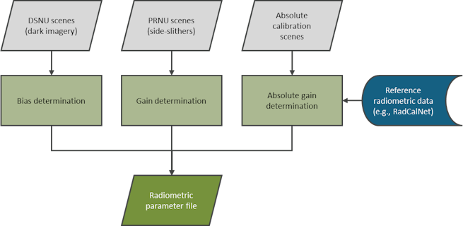
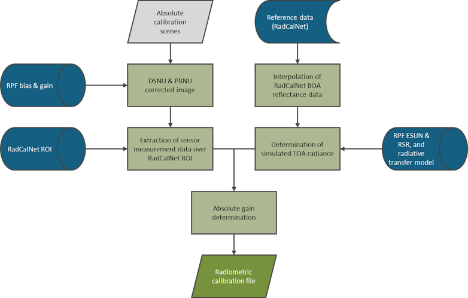
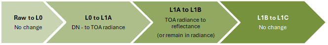
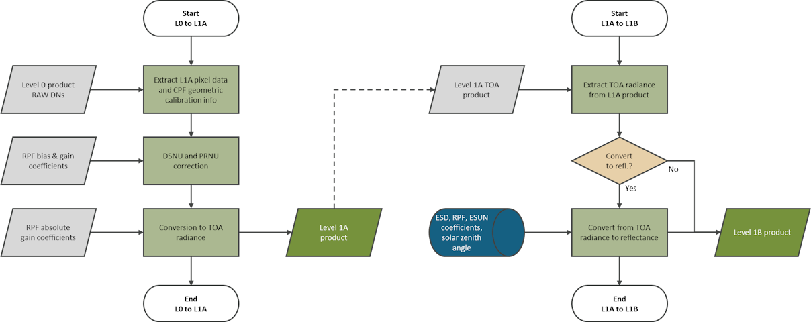

# Level 1 theory book: Radiometric reflective algorithms

##### [Home](../../../README.md) > [Level 1](../../../Level%201/) > [Theory books](../../Theory%20books/) > [Version 1.2](../Version%201.2/) > Theory book: Radiometric algorithms (reflective)
---

### Table of contents
- [Introduction](#introduction)
- [Radiometry](#radiometry)
   * [Radiometric calibration](#radiometric-calibration)
      + [Dark signal non-uniformity (DSNU) calibration](#dark-signal-non-uniformity-dsnu-calibration)
      + [Photo response non-uniformity (PRNU) calibration](#photo-response-non-uniformity-prnu-calibration)
      + [Absolute radiometric calibration](#absolute-radiometric-calibration)
   * [Radiometric processing - product generation](#radiometric-processing---product-generation)
      + [Dark signal non-uniformity calibration (DSNU) correction](#dark-signal-non-uniformity-calibration-dsnu-correction)
      + [Photo response non-uniformity (PRNU) correction](#photo-response-non-uniformity-prnu-correction)
      + [Absolute radiometric conversion](#absolute-radiometric-conversion)
   * [Radiometric validation](#radiometric-validation)
   * [Metrological traceability ](#metrological-traceability)
   * [Uncertainty characterisation](#uncertainty-characterisation)

## Introduction

This document describes the radiometric algorithms used to calibrate, process and validate imagery of an Earth observation sensor using *FarEarth*. This document applies to reflective (visible to near-infrared) imagery products up to Level 1. It is intended as a summary of the algorithms used. 

The following terminology is specific to *FarEarth*:

| Term                       | Description                    |
| -------------------------- | ------------------------------ |
| Radiometric Parameter File (RPF) | File containing information on the radiometric sensor properties, band spectral ranges and the radiometric calibration coefficients      |
| Detectors vs pixels | "Detector" is used when referring to the physical single element of a sensor array, while "pixel" is used when referring to a subgroup of detectors, which can be achieved by binning and/or time delay integration (TDI) |

## Radiometry

Radiometric algorithms are used to:

*	determine the calibration coefficients required to convert the sensor's raw Digital Number (DN) values to top-of-atmosphere (TOA) radiance or reflectance values
*	process the sensor's raw DN values to TOA radiance or reflectance
*	validate the quality of the radiometric products by comparing products to reference data

### Radiometric calibration

Radiometric calibration of an Earth observation sensor is performed in three steps:
* dark signal non-uniformity (DSNU) bias calibration
* photo response non-uniformity (PRNU) gain calibration
* absolute radiometric gain calibration

> Radiometric calibration overview

#### Dark signal non-uniformity (DSNU) calibration

Dark signal non-uniformity calibration (DSNU) is the determination of the sensor's dark signal/current that is present when no light falls on the sensor. 

<ins>Pre-launch</ins>: this bias can be determined using datasets obtained in a dark room with no light incident on the sensor. 

<ins>In-orbit</ins>: this can be determined using dark images over the South Pacific Ocean when the sun and moon are below the horizon.

The suitability of dark images is evaluated by examining the raw Digital Number (DN) values and checking for sun and moon elevation angles. Dark images must be acquired during a new moon. The dark current bias coefficients are determined and stored in the radiometric parameter file (RPF) for later use during image processing.

#### Photo response non-uniformity (PRNU) calibration

The photo response non-uniformity (PRNU) calibration involves determining the non-uniformity between detectors/pixels when light is incident on the sensor. After bias correction, a non-uniformity remains between the sensor detectors/pixels due to differences in sensitivity and defects across the sensor.

<ins>Pre-launch</ins>: the PRNU calibration can be performed pre-launch in the laboratory using a uniform target, such as an integrating sphere. 

<ins>In-orbit</ins>: you can perform PRNU calibration using acquisitions taken over uniform sites recommended by *FarEarth*.

For frame and pushframe sensors, in-orbit acquisitions are performed over uniform sites.

For pushbroom sensors, the preferred method is to use side-slither acquisitions, where the imagery is taken with the satellite turned by approximately 90° (yaw). This results in the detectors/pixels per row passing nearly over the same location. The detectors/pixels are then precisely aligned so all horizontal detectors/pixels are at the same point on Earth. The uniformity across the image is assessed. Areas that do not meet the minimum uniformity criteria are excluded from use for calibration.

The bias-corrected DN values in the uniform areas are compared across the sensor to determine the PRNU coefficients. This is stored as a gain coefficient per detector/pixel in the RPF for future use during processing.

> Side-slither

#### Absolute radiometric calibration

Absolute calibration of a sensor is important to provide reliable measurements for quantitative analysis and enable comparison with other sensors. For satellites with a multi-sensor payload design, it is essential to ensure that the sensors have equalised radiometric responses. Absolute radiometric calibration entails determining the coefficients required to convert the nonuniformity-corrected DNs to TOA radiance or reflectance.

<ins>Pre-launch</ins>: absolute radiometric calibration can be performed in the laboratory using a reference, such as an integrating sphere with known spectral radiance.

<ins>In-orbit</ins>: absolute radiometric calibration can be performed using measurements over CEOS-approved Radiometric Calibration Network (RadCalNet) sites. These provide reference measurements for Bottom-of-Atmosphere (BOA), Top-of-Atmosphere (TOA) reflectance, and atmospheric conditions are provided.

Acquisitions over RadCalNet sites are evaluated based on several criteria, including weather conditions, sensor performance, and satellite Navigation and Attitude (NavAtt). Images should be acquired near-nadir (off-nadir < 5°) to avoid errors due to atmospheric modelling.

The absolute gain coefficients are determined by comparing the calculated sensor's band-averaged TOA radiances to the corrected DN values as measured over the RadCalNet site. The RadCalNet site's TOA spectral reflectance is convolved with the relative spectral response (RSR) of the sensor bands and normalised to determine the bands' TOA reflectance. This is converted to TOA radiance using the band's calculated mean effective exo-atmospheric solar irradiance (ESUN), solar zenith angle and the Earth-Sun distance (ESD).
 
Alternatively, the calibration can also be performed using cross-calibration imagery from reference sensors with similar characteristics over CEOS-approved Pseudo-Invariant Calibration Sites (PICS).

The absolute gain coefficients, Earth-Sun distance (ESUN) values and relative spectral responses are stored in the RPF for future use during processing. 

A schematic representation of how the absolute gain coefficients are determined using RadCalNet data is given below.

> Absolute radiometric calibration

### Radiometric processing - product generation

During image processing in *FarEarth*, the sensor's raw DN values are corrected and converted to TOA radiance, or reflectance using the calibration coefficients as determined during the radiometric calibration process.

The correction of DN values to account for the dark signal non-uniformity (DSNU) and photo response non-uniformity (PRNU) of the sensor is performed during the L0 to L1A processing step, as well as the conversion to TOA radiance. The TOA radiance is converted to TOA reflectance in the L1A to L1B step, or it can be retained in TOA radiance. There are no changes to the radiometry in the L1B to L1C step, besides the changes due to resampling and mosaicking in the case of multiple sensor imagers. 

> Radiometric processing steps

#### Dark signal non-uniformity calibration (DSNU) correction 

The dark signal non-uniformity calibration (DSNU) correction is applied in the L0 to L1A processing step. This is done by subtracting the bias from the raw digital number (DN) values. The bias is determined by extracting the detector/pixel bias coefficients from the RPF and any other required information from the Level 0, such as sensor temperature and integration time. 

> **NOTE**: *DSNU-corrected DN values are unitless*

#### Photo response non-uniformity (PRNU) correction

The PRNU correction is applied in the L0 to L1A processing step by multiplying the bias-corrected DN values by the detector/pixel gains. The gains are determined by extracting the gain coefficients from the RPF and any other required information from the Level 0. 

> **NOTE**: *PRNU-corrected DN values are unitless*

#### Absolute radiometric conversion

The conversion to TOA radiance is performed in the L0 to L1A step by multiplying the PRNU-corrected DN values by the absolute gain. The absolute gain is determined by extracting the absolute gain coefficients from the RPF and any other required information from the L0. The band-averaged TOA radiance is in units of watts per square meter per steradian per micrometer:

$$\left[\frac{W}{m^2 sr \mu m}\right]$$

The conversion to TOA reflectance is performed in the L1A to L1B step by applying the ESUN coefficients retrieved from the RPF and Earth-Sun distance (ESD) and solar angle from the Level 1A metadata. The TOA is scaled by a factor of 104 for compression purposes.

**NOTE**: *The TOA reflectance is unitless*

> Radiometric processing L0-to-L1A and L1A-to-L1B

### Radiometric validation

Radiometric validation can be performed by comparing the radiometric data of the satellite image to a reference image. The reference image is a cloud-free image that is temporally close to the satellite image (for example, within 5 days) and from a reference satellite (for example, Sentinel-2). The comparison is more suitable for satellite sensors that have bands with spectral responses matching those of the reference satellite but can also be used for other sensors to monitor relative performance over time.

Radiometric performance can also be evaluated over time by comparing the results from acquisitions at RadCalNet sites to the RadCalNet reference data when it becomes available.

### Metrological traceability 

Satellites with an absolute radiometric calibration against a radiometric reference site (for example, RadCalNet) are traceable to SI units through the calibration of ground instruments. Satellites that have been calibrated to a reference sensor will have metrological traceability through the reference sensor's calibration. A *FarEarth* *In-orbit Calibration Report* documents the calibration process.

### Uncertainty characterisation

Although a complete uncertainty evaluation is not performed, the radiometric quality assessment provides an indication of radiometric accuracy by comparison to a reference sensor (example, Sentinel-2) or a reference site (example RadCalNet).

Contributions that influence the radiometric uncertainty include:

* uncertainty from the calibration of DSNU and PRNU
* uncertainty from the Absolute Gain calibration, which includes 
  * the uncertainty in the reference data 
  * the radiative transfer model
  * temporal interpolation and viewing geometry
  * differences in spectral responses between the satellite and reference satellite (if applicable)
* radiometric noise, stray light, and crosstalk
* satellite's performance during imaging, such as NavAtt stability and timing offsets
* geometric uncertainty and resampling methods used
