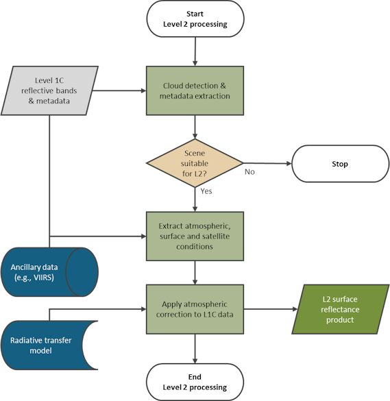
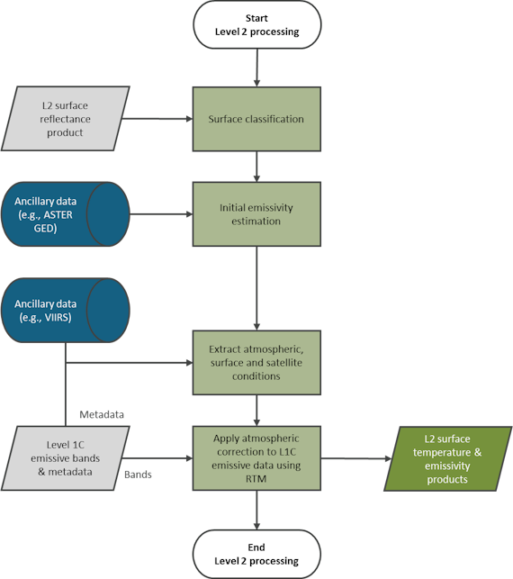

# Level 2 theory book: Algorithms

##### [Home](../../../README.md) > [Level 2](../../../Level%202/) > [Theory books](../../Theory%20books/) > [Version 1.3](../Version%201.3/) > Theory book
---

### Table of contents

- [Introduction](#introduction)
- [Level 2 algorithms](#level-2-algorithms)
   * [Reflective bands](#reflective-bands)
      + [Extraction of L1C reflective bands and metadata](#extraction-of-l1c-reflective-bands-and-metadata)
      + [Cloud masking ](#cloud-masking)
      + [Extraction of atmospheric, surface, and satellite conditions](#extraction-of-atmospheric-surface-and-satellite-conditions)
      + [Atmospheric correction using a radiative transfer model (RTM)](#atmospheric-correction-using-a-radiative-transfer-model-rtm)
      + [Generation of a Level 2 surface reflectance product](#generation-of-a-level-2-surface-reflectance-product)
   * [Emissive bands](#emissive-bands)
      + [Extraction of L1C emissive bands and metadata](#extraction-of-l1c-emissive-bands-and-metadata)
      + [Surface classification and initial emissivity estimation](#surface-classification-and-initial-emissivity-estimation)
      + [Extraction of atmospheric, surface and satellite conditions](#extraction-of-atmospheric-surface-and-satellite-conditions-1)
      + [Emissive bands atmospheric correction using a radiative transfer model (RTM)](#emissive-bands-atmospheric-correction-using-a-radiative-transfer-model-rtm)
      + [Generation of a Level 2 surface temperature and emissivity products](#generation-of-a-level-2-surface-temperature-and-emissivity-products)
   * [Validation](#validation)
   * [Metrological traceability ](#metrological-traceability)
   * [Uncertainty characterisation](#uncertainty-characterisation)

## Introduction

This document describes the algorithms used to produce a Level 2 product from an Earth observation sensor using *FarEarth*. This document applies to both reflective (visible to near-infrared) and emissive (thermal-infrared) imagery.  

The following terminology is specific to *FarEarth*:

| Term        | Description                   |
| ----------- | ----------------------------- |
| Radiometric Parameter File (RPF) | File containing information on the radiometric sensor properties, band spectral ranges, and the radiometric calibration coefficients|
| Detectors vs pixels | "Detector" refers to the physical single element of a sensor array. In contrast, "pixel" is used when referring to a subgroup of detectors, which can be achieved by binning and/or time delay integration (TDI) |

## Level 2 algorithms
Level 2 algorithms apply atmospheric corrections to top-of-atmosphere (TOA) Level 1 products. This generates bottom-of-atmosphere (BOA) Level 2 products that provide information about properties of the Earth's surface. Level 2 products are essential for remote sensing applications due to the significant effect the atmosphere has on Earth observation measurements. 

Level 2 algorithms are used for: 
* reflective bands (for example, from a Visible and Near-Infrared (VNIR) sensor)
    * surface reflectance
* emissive bands (for example, from a Thermal Infrared (TIR) sensor)
    * surface temperature
    * surface emissivity

The following are generated during image processing:
* cloud masks
* surface classification masks
* atmospheric conditions

### Reflective bands

Level 2 products generated from reflective bands are surface reflectance. The algorithm for the generation of a Level 2 surface reflectance product includes:

* extraction of Level 1C (L1C) reflective bands and metadata
* cloud mask evaluation and determination of suitability for Level 2 (L2) processing
* extraction of atmospheric, surface, and satellite conditions
* application of atmospheric correction using a radiative transfer model
* generation of a Level 2 surface reflectance product

#### Extraction of L1C reflective bands and metadata

The first step is to extract the reflective bands and metadata from the Level 1C input products for L1-to-L2 processor.

#### Cloud masking 

The Level 1C (L1C) reflective bands are used as input to a cloud detection algorithm, which determines which pixels are likely cloudy. Given a certain cloud percentage threshold, the scene is either marked as suitable for Level 2 (L2) processing or not. For example, if a 50% cloud-free threshold is set, but 60% of the image is marked as likely cloudy, the L2 processing will not continue.

#### Extraction of atmospheric, surface, and satellite conditions

To determine the atmospheric conditions at the time of acquisition, atmospheric measurements are retrieved from ancillary databases (for example, VIIRS). If a satellite has sensor bands such as coastal aerosol or water vapour, these can be used to improve atmospheric condition estimates. The aerosol optical depth (AOD) can also be estimated using an aerosol detection algorithm if the required spectral bands are available.

Surface conditions and satellite configuration conditions, such as altitude, satellite viewing angle, and solar zenith angle, are extracted from the L1C product metadata.

**NOTE**: *There is usually a latency of a few hours to a few days for the ancillary atmospheric condition databases. Therefore, historical values for the area of interest can be used to generate an initial estimate of a Level 2 product, which can later be reprocessed when more accurate data become available.*

#### Atmospheric correction using a radiative transfer model (RTM)

The atmospheric, surface, and satellite conditions are used as inputs to a radiative transfer model (RTM) to determine the atmospheric correction required to convert the L1C pixel data to surface reflectance.

#### Generation of a Level 2 surface reflectance product

After converting the Level 1 pixel data to surface reflectance, it is saved as a Level 2 surface reflectance product, including its corresponding metadata and quality information. This may include cloud masks, ancillary atmospheric conditions, and other quality metrics.

> Level 2 surface reflectance algorithm

### Emissive bands

The following emissive Level 2 products can be generated:
* surface temperature
* surface emissivity

The algorithms for generating Level 2 surface temperature and emissivity products include:
* extraction of Level 1C (L1C) emissive bands and metadata
* surface classification and initial emissivity estimation based on L2 reflective bands and ancillary data
* extraction of atmospheric, surface, and satellite conditions
* emissive bands atmospheric correction using a radiative transfer model (RTM)
* publishing of L2 surface temperature and emissivity products

**NOTE**: *Since the process depends on L2 reflective bands, it is only possible to start the L2 emissive product generation after the L2 reflective bands have been processed successfully.*

#### Extraction of L1C emissive bands and metadata

The first step is to extract the emissive bands and metadata from the Level 1C product provided as input to the L1-to-L2 processor.

#### Surface classification and initial emissivity estimation

Level 2 reflective bands generated as part of the surface reflectance process are used as input to a surface classification and initial surface emissivity algorithm. The surface reflectance data of the scene, together with ancillary sources containing historical surface emissivity and reflectance data (for example, ASTER GED), is used to determine an initial surface emissivity estimate.

#### Extraction of atmospheric, surface and satellite conditions

To determine the atmospheric conditions, such as total column ozone, total column water vapour, and aerosol optical depth (AOD) at the time of acquisition, atmospheric measurements are retrieved from ancillary databases (for example VIIRS). If a satellite has sensor bands such as those for coastal aerosol or water vapour, these can be used to improve atmospheric condition estimates. The AOD can also be estimated using an aerosol detection algorithm if the required bands are available.

Surface conditions and satellite configuration conditions, such as altitude and satellite viewing angle, are extracted from the L1C product metadata.

**NOTE**: *There is usually a latency of a few hours to a few days for the ancillary atmospheric condition databases. Therefore, historical values for the area of interest can be used to generate an initial estimate of the Level 2 product, which can later be reprocessed when more accurate data become available.*

#### Emissive bands atmospheric correction using a radiative transfer model (RTM)

The atmospheric, surface and satellite conditions, together with the initial emissivity estimate, are used as inputs to a radiative transfer model (RTM). This determines the atmospheric correction required to convert the L1C pixel data to surface temperature. 

#### Generation of a Level 2 surface temperature and emissivity products

After converting the Level 1 pixel data to surface temperature, it is saved as a Level 2 surface temperature product together with its corresponding metadata. In cases where multiple emissive bands are available, the surface emissivity and surface temperatures are updated using an optimisation algorithm. Quality information, such as surface classification, ancillary atmospheric conditions, and other metrics, can be published if required.

> Level 2 surface temperature and surface emissivity algorithm

### Validation

During validation, the generated surface data of the satellite image is compared to a reference surface image. The reference image should be a cloud-free image that is temporally close to the satellite image (for example, within a few hours) and from a reference satellite (for example, Sentinel L2A or Landsat L2SR products). The comparison is more suitable for satellite sensors that have bands with spectral responses matching those of the reference satellite, but can also be used for other sensors to monitor relative performance over time.

Furthermore, performance can also be evaluated over time by comparing the results from acquisitions over reference sites that provide reliable data.

### Metrological traceability 

Satellites with an absolute radiometric calibration against a radiometric reference site are traceable. The traceability is through the calibration of ground instruments and validation of the radiative transfer models, using the International System of Units (SI units). 

Satellites that have been calibrated to a reference sensor will have metrological traceability through the reference sensor's calibration. A *FarEarth In-orbit Calibration Report* documents the calibration process.

### Uncertainty characterisation

Although a complete uncertainty evaluation is not performed, the validation process indicates the accuracy of the radiometric performance by comparing it to a reference sensor or reference site.

Contributions that influence the radiometric uncertainty include:
* uncertainty from the Level 1 product generation
* uncertainty from the atmospheric, surface, and satellite conditions, for example, AOD, water vapour, viewing angle, and interpolation of these values
* uncertainty from the application of the radiative transfer model
* uncertainty from the emissivity estimation and optimisation for surface temperature and surface emissivity
